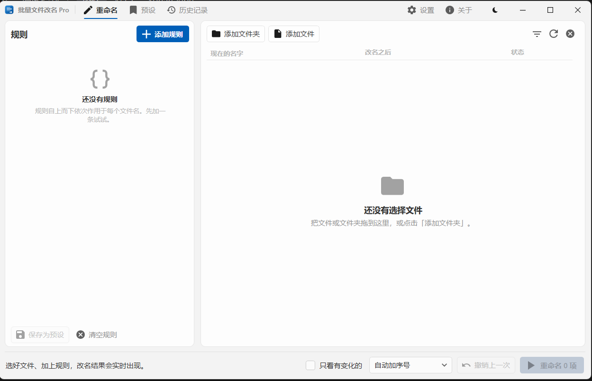
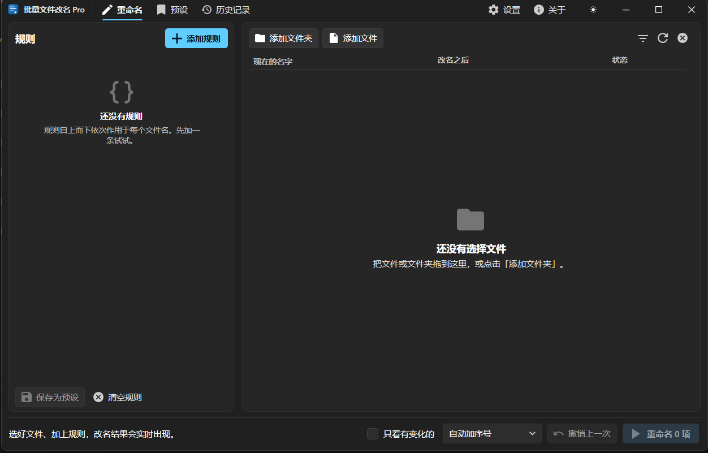

<div align="center">


# 批量文件改名 Pro

**Windows 批量改名工具：动手之前先看清它要做什么，做完之后还能撤回。**

[](https://github.com/Moresyl/BatchRenamePro/actions/workflows/ci.yml)
[](https://github.com/Moresyl/BatchRenamePro/releases)
[](LICENSE)
[](https://dotnet.microsoft.com/)
[](#运行环境)

[English](README.md) · [简体中文](README.zh-CN.md)

</div>

---

批量改名出错的代价往往是隐形的：几周后才发现有一半文件丢了扩展名。这个工具就是围绕这一点做的。
每加一条规则，预览区都会实时列出改名前后的对照，逐字符高亮变化；任何不安全的结果在**第一个文件被移动之前**
就会被拦下；真正执行时走的是两阶段事务，中途失败会把已经改掉的名字全部还原。

<div align="center">




<sub>重命名页的浅色与深色外观——运行时随时切换，不用重启。</sub>

</div>

<!--
    这两张是空载状态。还缺、而且比这两张更有说服力的是：同一个页面叠上几条规则、预览列显示
    改名前 → 改名后并高亮差异——上面那些说法里，只有这一条是图片真能替文字作证的。预设页也来一张。
    按窗口原始尺寸（约 1250x800）截好，和这两张放在一起命名为 rename.png 和 presets.png，
    每张控制在 400 KB 以内，然后替换上面的引用。
-->

## 核心能力

| | |
|---|---|
| **可组合规则** | 八种规则叠成一条流水线，后一条看到的是前一条的结果。"去掉下载后缀 → 转成标题式大小写 → 编号"是三张卡片，而不是跑三遍。 |
| **带差异高亮的实时预览** | 每一项都显示 原名 → 新名，插入和删除分别着色，并标出状态（未变更 / 将改名 / 被阻止 / 冲突）。 |
| **没有一次是盲跑的** | 系统保留名、非法字符、结尾的点、路径超长、目标重名、与磁盘上已有文件冲突——全部在规划阶段查出，并以能读懂的文字列出来。 |
| **事务式执行与撤销** | 改名经过暂存阶段，中途失败会回滚已改动的部分；成功的批次进入历史记录，之后仍可撤销。 |
| **预设** | 六套内置流水线，覆盖大家真正会打开改名工具去做的事；自定义预设保存为 JSON。 |
| **占位符** | 22 个占位符——文件名、扩展名、上级文件夹、序号、总数、大小、创建/修改时间（可自定义格式）、GUID、随机后缀——程序内自带速查表。 |
| **双语与无障碍** | 内置简体中文与 English，运行中切换、无需重启。所有可交互元素都为读屏软件命名，并由自动化 UI Automation 巡检验证。 |
| **现代 Windows 外观** | 自绘标题栏、Mica / 亚克力材质、浅色 / 深色 / 跟随系统、Per-Monitor V2 高 DPI；Win11 圆角，Win10 自动降级。 |
| **自动感知新版本** | 可在启动后检查 GitHub Releases，在软件内显示完整更新说明，并一键打开对应发布页；客户端不会自行下载或执行更新。 |
| **隐私边界清晰** | 无遥测、不提权；唯一可选联网行为是读取公开 GitHub Release 元数据，历史与日志仍只保存在 `%APPDATA%`。 |

## 安装

到 [最新发布页](https://github.com/Moresyl/BatchRenamePro/releases/latest) 下载对应电脑的安装包。
推荐直接双击 `.msi`：选择父目录后会自动创建 `Batch Rename Pro` 产品目录、桌面图标、开始菜单入口和“已安装的应用”卸载项；实际安装位置也会登记到 Windows。
便携使用则下载 `.zip`，解压后运行 `BatchRenamePro.exe`。两种形式都**无需预装 .NET**。

| 下载 | 适用机型 |
|---|---|
| `BatchRenamePro-win-x64.msi` | 绝大多数台式机和笔记本，推荐 |
| `BatchRenamePro-win-arm64.msi` | 骁龙 / ARM64 设备，推荐 |
| `BatchRenamePro-win-x86.msi` | 32 位 Windows，推荐 |
| `BatchRenamePro-win-*.zip` | 对应架构的免安装便携版 |

用同一发布页里的 `SHA256SUMS.txt` 校验下载的文件：

```powershell
Get-FileHash .\BatchRenamePro-win-x64.msi -Algorithm SHA256
```

## 快速上手

1. **添加文件** —— 直接拖进列表，或点击"文件" / "文件夹"。
2. **添加规则** —— 点击"添加规则"选一种。它会变成一张卡片，可展开、排序、停用或删除。
3. **看预览** —— 右侧随输入实时更新。红色行表示被阻止，问题条会说明原因。
4. **执行** —— 点击"开始重命名"。出任何问题，整批回滚。
5. **反悔了** —— 当次点"撤销"，或之后在"历史记录"页撤销。

### 八种规则

| 规则 | 作用 |
|---|---|
| **模板** | 按模板重建名称：`{modified:yyyy-MM-dd}_{name}_{index:000}`。同时兼容经典写法 `*`（原名称）和 `#`（序号）。 |
| **查找替换** | 普通文本或正则表达式，可忽略大小写。 |
| **编号** | 用连续序号命名——起始值、步长、补零位数、分组大小、数字或字母序列。关掉"替换整个名字"，序号就改为加在原名的前面、后面或指定位置。 |
| **文本命名** | 用一段文字（可含变量）命名。同样可以关掉"替换整个名字"，改为在开头、结尾或指定字符位置插入。 |
| **删除** | 删除字符区间，或删掉所有数字、符号、空白，或从某个标记处截断。 |
| **大小写** | 全大写、全小写、每词首字母大写、句首大写、大小写互换。 |
| **扩展名** | 更换、添加、移除扩展名，或统一其大小写。 |
| **清理** | 合并连续空白、去除首尾空格、去掉音调符号、把空格换成分隔符、剔除 Windows 不接受的字符。 |

每条规则都有**作用范围**：只作用于主文件名、只作用于扩展名，或整个名称。正是这一个开关让流水线保持简短——
你很少需要再加一条规则去保护扩展名不被上一条改坏。

### 重名怎么处理

当两个项目会得到同一个名字，或者这个名字在磁盘上已被占用时，由冲突策略决定：

- **阻止执行** —— 拒绝运行并指出是哪几行冲突。不容有失时用它，这也是默认值。
- **自动编号** —— 依次追加 ` (2)`、` (3)`……结果是确定的，同样的输入永远得到同样的输出。
- **跳过** —— 冲突的项目保持不动，其余照常改名。

## 运行环境

- Windows 10 1809（内部版本 17763）或更高版本，或 Windows 11
- x64、ARM64 或 x86
- 使用发布版无需任何 .NET 运行时；从源码构建需要 [.NET 10 SDK](https://dotnet.microsoft.com/download)

## 从源码构建

```powershell
git clone https://github.com/Moresyl/BatchRenamePro.git
cd batchrenamepro
dotnet restore BatchRenamePro.sln
dotnet build BatchRenamePro.sln -c Release
dotnet test  BatchRenamePro.sln -c Release
dotnet run   --project src\BatchRenamePro.App
```

生成与发布版一致的自包含单文件——发布参数写在项目文件里，所以只需指定目标运行时：

```powershell
dotnet publish src\BatchRenamePro.App\BatchRenamePro.App.csproj -c Release -r win-x64
```

把 `win-x64` 换成 `win-arm64` 或 `win-x86` 即可。产物是一个约 68 MB 的压缩单文件，不依赖任何外部 .NET 运行时。

> 构建把警告当作错误，分析器等级为 `latest-recommended`。这是刻意的：只有这样"构建通过"才是一个有意义的信号。
> 请修掉它，而不是压制它。

## 架构

```
BatchRenamePro.Core        没有界面，不依赖 Windows，全部由单元测试覆盖
├── Abstractions/          IRenameRule、RenameContext、NameParts、作用范围、诊断信息
├── Rules/                 八条规则——每条都是纯函数：(名称, 上下文) → 名称
├── Tokens/                占位符引擎与序号格式化
├── Planning/              规划器：跑流水线、校验、检测冲突
├── Execution/             两阶段事务改名、撤销、JSON 历史
├── Scanning/              文件与文件夹枚举
├── Sorting/               自然排序（与资源管理器一致）
└── Presets/               内置预设与 JSON 持久化

BatchRenamePro.App         WPF、MVVM、依赖注入
├── ViewModels/            每页一个，另有规则卡片与占位符选择器
├── Views/                 外壳窗口 + 五个页面
├── Themes/                设计令牌、配色、控件样式、规则编辑器
├── Controls/              差异高亮文本、带占位符选择的模板编辑框
├── Localization/          字符串表、{loc:T} 标记扩展、枚举数据源
├── Services/              设置、主题、对话框、通知、文件日志
└── Interop/               DWM 窗口外观——Mica、深色标题栏、圆角
```

两条约束保证分层不塌：

1. **Core 永不引用 WPF。** 它的目标框架是纯 `net10.0`；改名引擎测试保持跨平台，另有独立 Windows 测试项目覆盖 Release 集成。凡是不需要窗口就能定下来的事，都放在 Core。
2. **规划器是唯一的关口。** 规则不碰文件系统，只做字符串变换；校验、冲突检测、排序全部集中在一处。
   所以"预览显示的"和"实际执行的"不可能不一致。

新增一条规则 = 实现 `IRenameRule` + 在 `RuleCatalog` 注册 + 加一个编辑器 `DataTemplate` + 补上文案。
详见 [CONTRIBUTING.md](CONTRIBUTING.md)。

## 数据与隐私

程序以普通用户权限运行，从不提权。开启“启动时检查更新”后，只会匿名请求已配置公开 GitHub 仓库的
latest Release 接口，用于取得界面里显示的版本号、发布日期和更新说明；这个选项可以关闭，并且不会上传
文件名、历史记录、预设、日志、设备标识或使用数据。

它写入的所有内容都在同一个目录下：`%APPDATA%\BatchRenamePro`

| 内容 | 位置 |
|---|---|
| 设置 | `settings.json` |
| 自定义预设 | `Presets\` |
| 改名历史（用于撤销） | `History\` |
| 日志 | `Logs\` |

删掉这个目录即可把程序恢复到初始状态。历史记录有上限并会自动清理，上限可在"设置"页调整。

## 参与贡献

欢迎提 issue 和 PR —— 构建方式、编码约定、以及如何新增一条规则见 [CONTRIBUTING.md](CONTRIBUTING.md)，
协作方式见 [CODE_OF_CONDUCT.md](CODE_OF_CONDUCT.md)。安全问题请走 [SECURITY.md](SECURITY.md)，不要发到公开 issue。

适合入门的贡献：新增一条规则、新增一个内置预设、补一种语言的翻译，或者为目前只是"约定俗成"的行为补一个测试。

## 许可协议

[MIT](LICENSE) © Batch Rename Pro Contributors。

灵感来自经典 Windows 压缩软件的三页式改名流程，在 .NET 10 上从零重写，并配上一个可以信任的预览。
